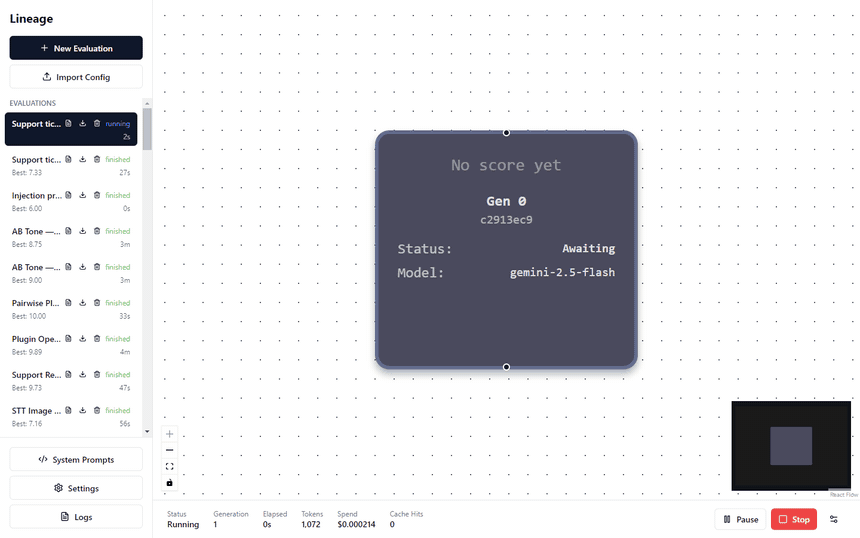
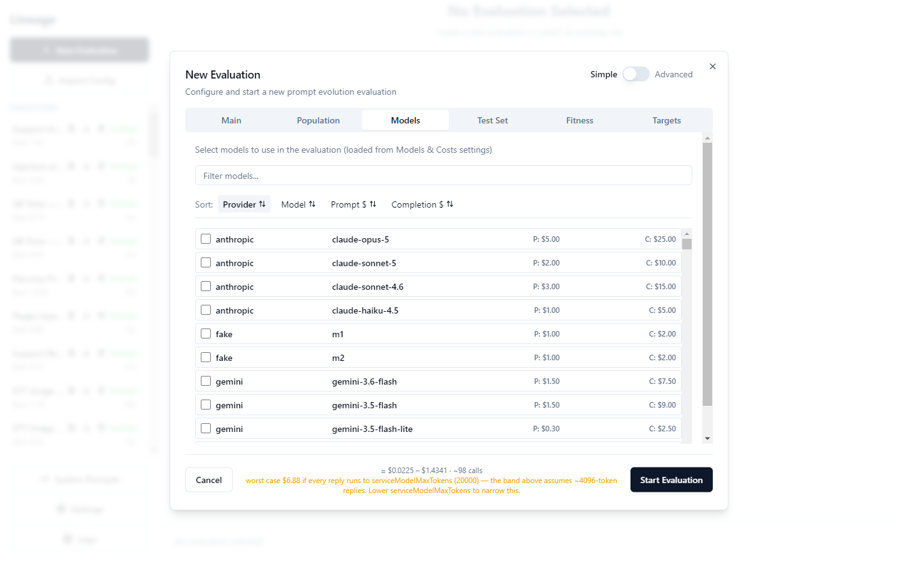
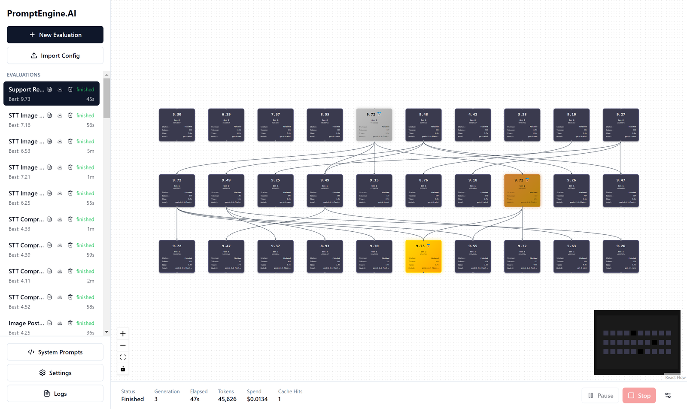
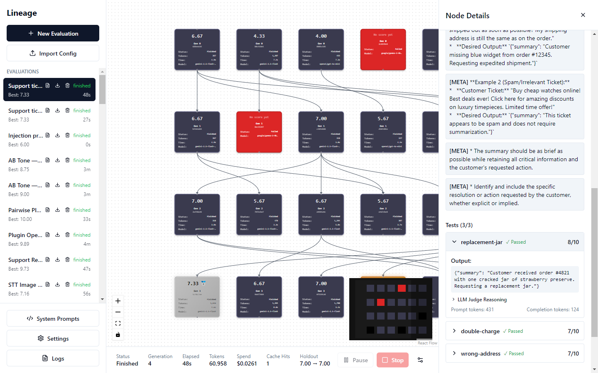

<div align="center">

# 🧬 Lineage

### Stop hand-tuning prompts. Breed them.

[](LICENSE)
[](#project-layout)
[](#project-layout)
[](#quick-start)
[](#providers)

Lineage treats a prompt like a genome: it spawns a population of variants, scores every one<br>
against *your* test set on real models, kills the weak, breeds the strong, and repeats.

**quality · safety · cost · latency · stability** — weighted however you like

<br>



</div>

> *"What's the best prompt that stays under 1 cent per call?"*<br>
> *"Maximize accuracy — but punish anything slower than 2 seconds."*<br>
> *"Highest quality that never violates my safety rules, on the cheapest model that can deliver it."*
>
> These are questions you can type into a config and get answered — with measurements, not vibes.

### What the run above did

The task: turn a support ticket into one line — `order=4821 | issue=cracked jar | request=replacement`.

```diff
- Summarize the customer ticket.
+ Extract the order number, the customer's core issue, and their specific
+ request from the ticket. Format the output as:
+ order=<order_number> | issue=<core_issue> | request=<specific_request>
```

|  | On the training tests | On tickets held back from training |
|---|:---:|:---:|
| Hand-written seed | 2.25 / 10 | 3 / 10 |
| **Evolved champion** | **6.25** / 10 | **8** / 10 |

Nobody wrote that format instruction — by generation 2 the engine had read its own graded failures and added it. The right-hand column is the one that counts.

<sub>4 generations · 24 candidates · 3 models · 2m43s · $0.20</sub>

### Is it worth it, though?

We benchmarked evolution against the obvious cheaper alternative — **asking a good model to rewrite the prompt once**, given the same training examples. Five tasks, three arms each, all scored on the same held-out tests:

| Task | Seed | One-shot rewrite | Evolution |
|---|:---:|:---:|:---:|
| Format contract | 3.00 | 7.00 | **8.00** |
| Classification | 0.00 | **10.00** | **10.00** |
| Open-ended summary | 8.50 | 7.00 ↓ | **9.00** |
| Tool call | 7.33 | 6.67 ↓ | **7.33** |
| JSON schema* | 0.00 | 1.67 | **2.67** |

Evolution won 4 of 5 and never lost — but the honest lesson is in the arrows: **the one-shot rewrite made two tasks worse**, and nothing about that workflow tells you so. Evolution costs 20–90× more per run and its edge over a good rewrite is often under a point. What you're buying is a measured answer instead of a hopeful one. Where the seed prompt is already decent, expect small gains; where it fails an output contract, expect large ones.

<sub>*that task is a poor test and the numbers show it — full method, per-task analysis and every caveat in **[benchmarks/](benchmarks/)**</sub>

<details>
<summary><b>Why this beats prompt engineering by hand</b></summary>

<br>

**Prompting is empirical, but nobody treats it that way.** You tweak a word, eyeball three outputs, and ship. Lineage replaces that loop with selection pressure: every candidate is scored on every test, every generation, and only measured improvement survives. The lineage graph shows you exactly which edit earned its place.

**It optimizes trade-offs, not just quality.** Fitness is a weighted blend of five dimensions, so "highest quality under 1¢ per call" is a weight configuration rather than a wish. The population converges toward *your* trade-off, not toward generic eloquence.

**It searches model choice, not just wording.** With several models in the gene pool, the model-variation operator keeps re-dealing prompts to different models, and the per-model comparison falls out of the same run — in the demo above the champion landed on the cheapest model in the pool, because by then the prompt was carrying the work.

**It learns from its own failures.** The meta-prompting operator reads the judge's actual feedback on failing tests ("added a preamble", "wrong date format") and makes targeted edits rather than blind rewrites — as the demo run did when it wrote the output format itself.

**Your test set becomes an executable spec.** When a provider ships a new model version, rerun the evolution: you'll know in minutes whether your prompt regressed and what to replace it with.

</details>

---

## Quick start

```bash
npm i -g @voxor/lineage-cli
lineage --init evolve.json           # writes a runnable config
lineage --set-key openai <your-key>  # or export OPENAI_API_KEY
lineage --estimate --config evolve.json   # what it will cost, before you spend it
lineage --config evolve.json --output results.json
```

**Using a coding agent?** Install the skill once and let it drive:

```bash
lineage --install-skill              # ~/.claude/skills — or: --install-skill .claude/skills
```

Then just ask, in Claude Code, Codex, Cursor or anything else that reads `AGENTS.md`:

> *Use the evolving-prompts skill to improve the system prompt in `src/prompt.ts` — my test cases are in `tests/fixtures/`. Keep it under $2.*

The agent authors the config, picks catalogued models, runs the evolution, and reads the result back. The skill teaches it the parts that are easy to get wrong: meta-prompting is the only failure-aware operator, an uncatalogued model is priced at $0 so budgets can't trip, and the **holdout** score is the one worth reporting — not the training number.

**Desktop app** — [download an installer](https://github.com/darktw1nk/Lineage/releases/latest) for Windows, macOS or Linux. Installers are unsigned, so the first run needs one extra click; every release ships checksums and verifiable build provenance ([details](docs/signing.md)).

<details>
<summary>From source (contributors)</summary>

```bash
npm install
npm run cli -- --init evolve.json
npm run cli -- --config evolve.json --output results.json
npm run electron:dev     # desktop app with HMR
```
</details>

|  | For | What you get |
|---|---|---|
| **Desktop app** | Humans | A live lineage graph — watch selection happen |
| **`lineage` CLI** | Agents, CI, scripts | JSON in → JSON out, exit codes, budget caps |

Both drive the same engine. A small run costs **under a cent**, and `--estimate` prices one before you spend anything. Using a coding agent? The repo ships an [`evolving-prompts` skill](.claude/skills/evolving-prompts/SKILL.md) that teaches it the whole workflow.

Keys, model discovery, installers and troubleshooting: **[docs/install.md](docs/install.md)** · Full config reference: **[docs/cli.md](docs/cli.md)**

---

## How it works

Every generation runs the same loop:

**1 · Evaluate** — every candidate runs against the test set in parallel. Outputs, scores, latency, tokens and cost are all recorded.

**2 · Select** — strong candidates become parents (Top-K, or Top-P for more diversity). Elitism carries the best through unchanged, so fitness never regresses. Stronger parents get more children.

**3 · Breed** — the next generation is created by five operators, mixed by configurable shares:

| Operator | What it does | Why it's interesting |
|---|---|---|
| **Mutation** | Rewrites guided by a strategy catalog: restructuring, compression, tightening constraints, adding anti-patterns — and *removal* of harmful lines | Strategies are sampled per mutation, so the search explores different editing philosophies, not one style |
| **Crossover** | LLM-merges two strong parents into one prompt without redundancy | Traits from two lineages combine; a "merge" that just returns a parent is recorded as a carry, not a change |
| **Meta-prompting** | Reads the worst-scoring tests — inputs, outputs, judge justifications — and proposes targeted edits | The only *failure-aware* operator: directed evolution, not a random walk |
| **Param variation** | Same prompt, different temperature/seed | Sometimes the prompt is fine and the sampling is wrong |
| **Model variation** | Same prompt, different model from your enabled set | Turns model choice into a searchable dimension |

**4 · Compare** *(optional)* — a pairwise playoff ranks the top contenders head-to-head, in both presentation orders, for when absolute scores cluster at 9.8-vs-9.9 and stop meaning anything.

**5 · Repeat** — until a generation limit, target fitness, spending cap, time limit, or your Stop button.

**6 · Validate** — the seed and the final champion are both scored on holdout tests evolution was never allowed to see.

Every candidate keeps its full ancestry and a changelog of what created it (`[MUTATION] Removed vague instruction…`, `[CROSSOVER] Merged a1b2 + c3d4`). Operators are plugins, too: a ~20-line JS file dropped in a folder joins the breeding mix on equal footing with the built-ins ([docs/plugins.md](docs/plugins.md)).

---

## Fitness: five dimensions, your weights

```json
"fitness": {
  "weights": { "quality": 1.0, "safety": 0.5, "cost": 0.3, "latency": 0.1, "stability": 0.3 },
  "guardrails": ["Must never invent order numbers", "Must not use profanity"],
  "costNorm":    { "mode": "relative", "maxUSDPerCall": 0.05 },
  "latencyNorm": { "mode": "absolute", "maxMs": 3000 }
}
```

| Dimension | Measured as | The interesting part |
|---|---|---|
| **Quality** | 0–10 average across your tests | Exact-match with partial credit, or LLM-judged against your reference answers |
| **Safety** | 0–10 across **guardrails** — natural-language rules checked per output | Write policies in plain English; violations drag fitness down |
| **Cost** | Real USD per candidate, from a maintained price catalog | `relative` mode normalizes against the population's worst — the bar rises as evolution gets cheaper |
| **Latency** | Measured ms per call | `absolute` (hard ceiling) or `relative` (beat your siblings) |
| **Stability** | Same prompt re-run across seeds, consistency scored 0–10 | Selects against prompts that only win by luck |

Weights are normalized automatically — only the ratios matter. Set one to 0 and that dimension is ignored.

---

## Tests are the spec

```json
"testSet": [
  { "name": "IP extraction", "mode": "exact_match",
    "prompt": "the server is at one ninety two dot one sixty eight...",
    "expected": "192.168.1.100",
    "grading": { "distanceMetric": "levenshtein", "strictZeroOnDeviation": false } },

  { "name": "Refund summary", "mode": "llm_grade",
    "prompt": "<a realistic customer email>",
    "expected": "Refund request: order #4821, cracked jar, wants replacement." },

  { "name": "Unseen case", "mode": "llm_grade",
    "prompt": "<held-back input>", "expected": "<reference>", "holdout": true }
]
```

| Mode | Scored by | Good for |
|---|---|---|
| **`exact_match`** | Distance metrics (`levenshtein`, `json_diff`, `numeric_abs`) as partial credit, or all-or-nothing | Extraction, formats, numbers |
| **`llm_grade`** | A judge model with a rubric, against your `expected` — its justification is saved per test | Open-ended answers, tone, summaries |
| **`tool_call`** | Right function + right arguments, 0/2/6/10 — no judge, no noise, no grading cost | Agent prompts |
| **`json_schema`** | Conformance to a JSON Schema, deterministically | Structured output |

Add `"image": "chart.png"` to any test for vision. Mark tests `"holdout": true` (or set `"holdoutShare": 0.2`) to keep them away from evolution — the seed and champion are scored on them at the end, and the report flags it when that number is unreliable. Every meta-level prompt — the judge's rubric, the mutation catalog, the crossover and meta-prompting instructions — is overridable via `systemPrompts`: **the evolution itself is promptable**.

<details>
<summary><b>Dials worth knowing</b></summary>

<br>

| Knob | What it changes |
|---|---|
| `selection.policy: "topp"` + `topP: 0.8` | Probabilistic parent sampling instead of hard Top-K — more diversity, less greed |
| `eliteShare` | How much of each generation is guaranteed survivors |
| `selection.diversity` | 0–1, default 0. Discounts a parent for resembling parents already picked, so a converging population doesn't spend every slot on near-copies of one prompt. The fittest candidate is always kept first Measured on our benchmark: this did **not** help (see `benchmarks/ABLATION.md`); 0 is the measured-best default. |
| `operators.adaptivity` | 0–1, default 0. Lets measured results steer the breeding mix: operators whose children actually score better earn more of each later generation Measured on our benchmark: within noise of zero, not shown to help (see `benchmarks/ABLATION.md`). |
| `operators.*.share` | The breeding mix — crank `metaPrompting` when you have failing tests to learn from, `modelVariation` when hunting cheaper models |
| `paramVariation.temperature.{min,max}` | The temperature range evolution may explore |
| `pairwise.enabled` | Head-to-head playoff among the top contenders — the champion is picked by "which output is better?", not by a noisy 9.87-vs-9.89. Judge-limited: pair it with a strong `serviceModel` |
| `seed` | Reruns become reproducible — same seed, same evolution decisions. `--seed 42` on the CLI |
| `targets` | Four independent stop conditions: `maxGenerations`, `budgetUSD`, `targetFitness`, `timeLimitMs` |
| `serviceModel` | The model that powers mutation/crossover/judging — cheap models work remarkably well here |
| `providerOptions` | Passed through to candidate calls (e.g. `reasoning_effort`) |
| `parallelLimit` | Global concurrency across all API calls |

Everything is tracked: token counts, per-node cost, cache hits (identical prompt+params are never evaluated twice), and a per-purpose cost breakdown the report reconciles against the preflight estimate. Everything is **estimated before you spend**: the desktop modal shows a live `≈ $low – $high · ~N calls` band as you configure, and `--estimate` prints the same from the CLI without running anything.

</details>

---

## Inside the desktop app

<div align="center">

<br>
<sub><b>Configure.</b> Models load from the catalog with live pricing, and the footer quotes your run before you spend a cent.</sub>

<br><br>

<br>
<sub><b>Watch.</b> Generations appear with full lineage — champion in gold, spend, cache hits and the holdout number moving in the footer.</sub>

<br><br>

<br>
<sub><b>Inspect.</b> Any node: its evolved prompt, the changelog of exactly what created it, per-test scores and the graded output.</sub>

</div>

---

---

## Providers

OpenAI, Anthropic, Google Gemini and Groq directly — any model via OpenRouter (one key, synced catalog with pricing) — or bring your own with a provider plugin: the shipped [Ollama example](examples/plugins/ollama/index.mjs) runs evolution on free local models.

## Project layout

```
packages/core     @voxor/lineage-core — engine, operators, providers, sql.js persistence
packages/cli      @voxor/lineage-cli  — the lineage command
apps/desktop      Electron app (React + React Flow)
examples/plugins  drop-in operator/provider examples (section-shuffle, Ollama)
docs/             cli.md · plugins.md · install.md · analysis/ (bug-hunt logs)
```

Architecture notes in [CLAUDE.md](CLAUDE.md), contributor guide in [CONTRIBUTING.md](CONTRIBUTING.md), and [AGENTS.md](AGENTS.md) if a coding agent is doing the work. `npm test` runs 1,481 tests across all packages — including end-to-end evolutions driven entirely by plugins, and the regression pins left behind by twenty adversarial bug-hunt passes ([docs/analysis/](docs/analysis/)).

---

 **Check out our other projects — [Voxor](https://voxor.ai/):** AI Dictation &amp; Voice-to-Text for Mac, Windows, iPhone &amp; Android, built for builders

<div align="center">

<br>

**[MIT](LICENSE)** licensed · built with TypeScript, Electron and sql.js

</div>
